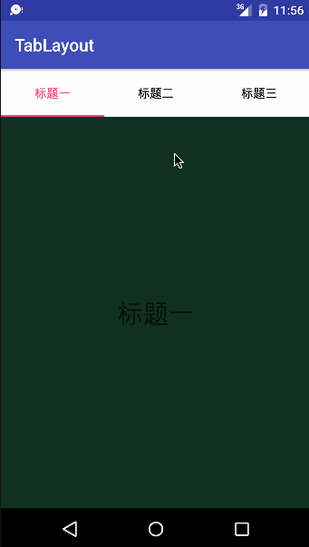
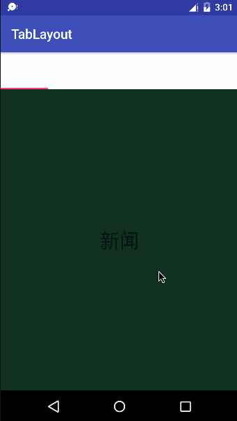
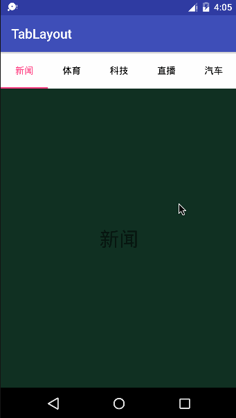
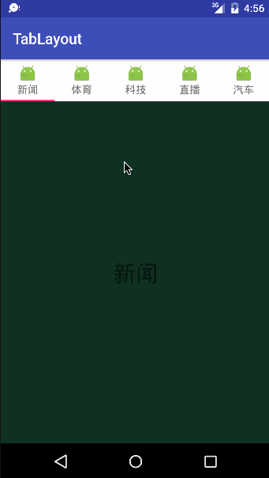

# TabLayout 的使用  
首先需要在 build.gradle 中添加依赖才可以：  
```XML
compile 'com.android.support:design:25.3.1'
```  
然后要让 Activity 继承自 AppCompatActivity，如果因某些原因无法这样做的话可以指定当前 Activity 的 Theme：  
```XML
android:theme="@style/Theme.AppCompat"
```  
首先介绍他的几个属性：  

名称 | 介绍  
----- | -----  
tabIndicatorColor | 指示器的颜色  
tabIndicatorHeight | 指示器的高度  
tabMode | 模式
tabSelectedTextColor | 选中的字体颜色  
tabTextColor | 未选中的字体颜色

tabMode属性的取值有两个：scrollable 和 fixed 

* scrollable:TabLayout认为TabItem总数宽度大于屏幕宽度，会自动成为水平滚动模式
* fixed: TabLayout会按TabItem的个数将屏幕平均分割宽度  

#### 有时候我们不需要指示器，我们可以这么做：  

1.把指示条高度设为0：
```xml
app:tabIndicatorHeight="0dp"
```  
2.把指示条的颜色设为透明
```
app:tabIndicatorColor="@color/transparent"
```
#### 如果要修改 TabLayout 中的字体大小呢？
TabLayout 中有个属性 tabTextAppearance，这里可以指定一个 style，所以我们定义一个 style:
```XML
<style name="TabLayoutTextStyle">
    <item name="android:textSize">16sp</item>
</style>
```
然后在 TabLayout 中这样设置就可以达到修改字体大小的效果了：
```XML
app:tabTextAppearance="@style/TabLayoutTextStyle"
```
默认选择第一个
```JAVA
tabLayout.getTabAt(0).select();
```          
********************************  
#### 情形一(已知 TabItem 的个数等相关信息)  
   
#### XML代码
```XML
<?xml version="1.0" encoding="utf-8"?>
<LinearLayout
    xmlns:android="http://schemas.android.com/apk/res/android"
    xmlns:app="http://schemas.android.com/apk/res-auto"
    android:layout_width="match_parent"
    android:layout_height="match_parent"
    android:orientation="vertical">

    <android.support.design.widget.TabLayout
        android:id="@+id/tab_layout"
        android:layout_width="match_parent"
        android:layout_height="?attr/actionBarSize"
        android:background="#FFFFFF"
        android:fillViewport="false"
        app:layout_scrollFlags="scroll"
        app:tabIndicatorColor="@color/colorAccent"
        app:tabIndicatorHeight="2dp"
        app:tabMode="fixed"
        app:tabSelectedTextColor="@color/colorAccent"
        app:tabTextColor="#000000">

        <android.support.design.widget.TabItem
            android:layout_width="match_parent"
            android:layout_height="match_parent"
            android:text="标题一"/>

        <android.support.design.widget.TabItem
            android:layout_width="match_parent"
            android:layout_height="match_parent"
            android:text="标题二"/>

        <android.support.design.widget.TabItem
            android:layout_width="match_parent"
            android:layout_height="match_parent"
            android:text="标题三"/>
    </android.support.design.widget.TabLayout>

    <android.support.v4.view.ViewPager
        android:id="@+id/view_pager"
        android:layout_width="match_parent"
        android:layout_height="match_parent"/>
</LinearLayout>
```
#### MainActivity
```JAVA
public class MainActivity extends AppCompatActivity {

    TabLayout tabLayout;
    ViewPager viewPager;

    @Override
    protected void onCreate(Bundle savedInstanceState) {
        super.onCreate(savedInstanceState);
        setContentView(R.layout.activity_main);

        init();
    }

    private void init() {
        tabLayout = (TabLayout) findViewById(R.id.tab_layout);
        viewPager = (ViewPager) findViewById(R.id.view_pager);

        List<Fragment> list = new ArrayList<>();
        list.add(new MyFragment("标题一"));// 就是一个普通的 Fragment,里面有一个 TextView 显示第几个
        list.add(new MyFragment("标题二"));
        list.add(new MyFragment("标题三"));
		//正常设置 Adapter
        viewPager.setAdapter(new ViewPagerAdapter(getSupportFragmentManager(), list));
        tabLayout.setupWithViewPager(viewPager);// 官方推荐

        for (int i = 0; i < list.size(); i++) {// 这里的坑稍后解释
            tabLayout.getTabAt(i).setText(((MyFragment)list.get(i)).getTitle());
        }
    }
}
```
#### 情形二(未知 TabItem 的个数等相关信息，动态添加) 
有时候我们不知道 TabItem 的个数，而是从服务器等其他途径获得，这个时候我们就需要动态来添加了，xml 的代码比较简单：
#### XML代码
```XML
<?xml version="1.0" encoding="utf-8"?>
<LinearLayout
    xmlns:android="http://schemas.android.com/apk/res/android"
    xmlns:app="http://schemas.android.com/apk/res-auto"
    android:layout_width="match_parent"
    android:layout_height="match_parent"
    android:orientation="vertical">

    <android.support.design.widget.TabLayout
        android:id="@+id/tab_layout"
        android:layout_width="match_parent"
        android:layout_height="?attr/actionBarSize"
        android:background="#FFFFFF"
        android:fillViewport="false"
        app:layout_scrollFlags="scroll"
        app:tabIndicatorColor="@color/colorAccent"
        app:tabIndicatorHeight="2dp"
        app:tabMode="scrollable"
        app:tabSelectedTextColor="@color/colorAccent"
        app:tabTextAppearance="@style/TabLayoutTextStyle"
        app:tabTextColor="#000000"/>

    <android.support.v4.view.ViewPager
        android:id="@+id/view_pager"
        android:layout_width="match_parent"
        android:layout_height="match_parent"/>
</LinearLayout>
```
#### MainActivity
```JAVA
public class MainActivity extends AppCompatActivity {

    TabLayout tabLayout;
    ViewPager viewPager;

    @Override
    protected void onCreate(Bundle savedInstanceState) {
        super.onCreate(savedInstanceState);
        setContentView(R.layout.activity_main);

        init();
    }

    private void init() {
        tabLayout = (TabLayout) findViewById(R.id.tab_layout);
        viewPager = (ViewPager) findViewById(R.id.view_pager);

        List<MyFragment> list = new ArrayList<>();// 装载的viewpager的数据
        List<String> tabList = getTab();
        for (int i = 0; i < tabList.size(); i++) {
            tabLayout.addTab(tabLayout.newTab().setText(tabList.get(i)));// 给 tabLayout 添加 Tab
            list.add(new MyFragment(tabList.get(i)));
        }

        viewPager.setAdapter(new ViewPagerAdapter(getSupportFragmentManager(), list));
        tabLayout.setupWithViewPager(viewPager);
    }

    // 假如这是从服务器获取的数据
    private List<String> getTab(){
        List<String> list = new ArrayList<>();
        list.add("新闻");
        list.add("体育");
        list.add("科技");
        list.add("直播");
        list.add("汽车");
        list.add("公益");
        list.add("娱乐");
        list.add("财经");
        list.add("时尚");
        list.add("房产");
        list.add("旅游");
        list.add("艺术");
        return list;
    }
}
```
然后我们看看实际效果  
   
标题呢？我的标题呢？这里就有一个坑了，看看 setupWithViewPager() 的源码怎么回事？
```JAVA
private void setupWithViewPager(@Nullable final ViewPager viewPager, boolean autoRefresh,
            boolean implicitSetup) {
        if (mViewPager != null) {
            // If we've already been setup with a ViewPager, remove us from it
            if (mPageChangeListener != null) {
                mViewPager.removeOnPageChangeListener(mPageChangeListener);
            }
            if (mAdapterChangeListener != null) {
                mViewPager.removeOnAdapterChangeListener(mAdapterChangeListener);
            }
        }

        if (mCurrentVpSelectedListener != null) {
            // If we already have a tab selected listener for the ViewPager, remove it
            removeOnTabSelectedListener(mCurrentVpSelectedListener);
            mCurrentVpSelectedListener = null;
        }

        if (viewPager != null) {
            mViewPager = viewPager;

            // Add our custom OnPageChangeListener to the ViewPager
            if (mPageChangeListener == null) {
                mPageChangeListener = new TabLayoutOnPageChangeListener(this);
            }
            mPageChangeListener.reset();
            viewPager.addOnPageChangeListener(mPageChangeListener);

            // Now we'll add a tab selected listener to set ViewPager's current item
            mCurrentVpSelectedListener = new ViewPagerOnTabSelectedListener(viewPager);
            addOnTabSelectedListener(mCurrentVpSelectedListener);

            final PagerAdapter adapter = viewPager.getAdapter();
            if (adapter != null) {
                // Now we'll populate ourselves from the pager adapter, adding an observer if
                // autoRefresh is enabled
                setPagerAdapter(adapter, autoRefresh);
            }

            // Add a listener so that we're notified of any adapter changes
            if (mAdapterChangeListener == null) {
                mAdapterChangeListener = new AdapterChangeListener();
            }
            mAdapterChangeListener.setAutoRefresh(autoRefresh);
            viewPager.addOnAdapterChangeListener(mAdapterChangeListener);

            // Now update the scroll position to match the ViewPager's current item
            setScrollPosition(viewPager.getCurrentItem(), 0f, true);
        } else {
            // We've been given a null ViewPager so we need to clear out the internal state,
            // listeners and observers
            mViewPager = null;
            setPagerAdapter(null, false);
        }

        mSetupViewPagerImplicitly = implicitSetup;
    }
```
然后我们看到了这么一段：
```JAVA
final PagerAdapter adapter = viewPager.getAdapter();
if (adapter != null) {
    // Now we'll populate ourselves from the pager adapter, adding an observer if
    // autoRefresh is enabled
    setPagerAdapter(adapter, autoRefresh);
}
```
继续看 setPagerAdapter 方法里面调用了 populateFromPagerAdapter():
```JAVA
void populateFromPagerAdapter() {
    removeAllTabs();

    if (mPagerAdapter != null) {
        final int adapterCount = mPagerAdapter.getCount();
        for (int i = 0; i < adapterCount; i++) {
            addTab(newTab().setText(mPagerAdapter.getPageTitle(i)), false);
        }

        // Make sure we reflect the currently set ViewPager item
        if (mViewPager != null && adapterCount > 0) {
            final int curItem = mViewPager.getCurrentItem();
            if (curItem != getSelectedTabPosition() && curItem < getTabCount()) {
                selectTab(getTabAt(curItem));
            }
        }
    }
}
```
方法里的第一行！瞬间脑海中一万只草泥马奔腾而过，why? why? why? 好吧你赢了，看到这里我们应该想到了2种解决办法：  
1.既然我绑定后你全给我 remove掉了，那就先不绑定了，你丑你先 remove 我后绑定还不行吗？  
2.在它 remove 完之后我们看到它重新添加Tab的时候是通过adapter中的getPageTitle()方法来做的：
```JAVA
addTab(newTab().setText(mPagerAdapter.getPageTitle(i)), false);
```
因此，我们重写一下viewpager的adapter中的getPageTitle()方法即可,也推荐这种方法  
首先我们定义一个 ViewPagerBean 来存放 Fragment 和 title：
```JAVA
public class ViewPagerBean implements Serializable {
    public MyFragment fragment;
    public String title;

    public ViewPagerBean(MyFragment fragment, String title) {
        this.fragment = fragment;
        this.title = title;
    }
}
```
然后修改一下 Adapter ：
```JAVA
public class ViewPagerAdapter extends FragmentPagerAdapter {

    List<ViewPagerBean> list = new ArrayList<>();
    public ViewPagerAdapter(FragmentManager fm,List<ViewPagerBean> list) {
        super(fm);
        this.list = list;
    }

    @Override
    public MyFragment getItem(int position) {
        return list.get(position).fragment;// 这里返回 MyFragment
    }

    @Override
    public int getCount() {
        return list.size();
    }

    @Override
    public CharSequence getPageTitle(int position) {
        return list.get(position).title;// 这里返回 title
    }
}
```
最后在 MainActivity 中这样写 :
```JAVA
private void init() {
    ...
    List<String> tabList = getTab();// 还是之前的数据

    List<ViewPagerBean> list = new ArrayList<>();
    for (int i = 0; i < tabList.size(); i++) {
        ViewPagerBean bean = new ViewPagerBean(new MyFragment(tabList.get(i)),tabList.get(i));
        list.add(bean);// 组合新数据
    }

    viewPager.setAdapter(new ViewPagerAdapter(getSupportFragmentManager(), list));// 将我们的新数据传给 Adapter
    tabLayout.setupWithViewPager(viewPager);
}
```
再来看效果：  
   
OK,完美解决了。
#### 如果要显示文字+图片等效果呢？
这个更简单了，同样的两种方法：
1.系统已经提供了这个API
```XML
<android.support.design.widget.TabItem
    android:layout_width="wrap_content"
    android:layout_height="wrap_content"
    item:icon="@mipmap/ic_launcher"
    item:text="标题一"/>
```
或者在代码里设置：
```JAVA
tabLayout.addTab(tabLayout.newTab().setText("标题一").setIcon(R.mipmap.ic_launcher));
tabLayout.addTab(tabLayout.newTab().setText("标题二").setIcon(R.mipmap.ic_launcher));
```
至于设置的图片的大小...在 android.support.design.widget.TabLayout 的1699行可以debug搞到，设置成48*48的大小了，
#### 这里还有一个问题，如果还是用的之前的 Adapter 的话会发现之前添加的Tab也在，所以不显示标题的两种解决方案不要同时使用！
2.自定义TabItem的布局 tab.xml：
```XML
<?xml version="1.0" encoding="utf-8"?>
<LinearLayout
    xmlns:android="http://schemas.android.com/apk/res/android"
    android:layout_width="wrap_content"
    android:layout_height="wrap_content"
    android:gravity="center"
    android:orientation="vertical">

    <ImageView
        android:id="@+id/iv"
        android:layout_width="24dp"
        android:layout_height="24dp"/>

    <TextView
        android:id="@+id/tv"
        android:layout_width="wrap_content"
        android:layout_height="wrap_content"/>
</LinearLayout>
```
很简单，然后在Activity中：
```JAVA
private void init() {
    tabLayout = (TabLayout) findViewById(R.id.tab_layout);
    viewPager = (ViewPager) findViewById(R.id.view_pager);
    List<String> tabList = getTab();

    List<ViewPagerBean> list = new ArrayList<>();
    for (int i = 0; i < tabList.size(); i++) {
        ViewPagerBean bean = new ViewPagerBean(new MyFragment(tabList.get(i)),tabList.get(i));
        list.add(bean);
    }

    viewPager.setAdapter(new ViewPagerAdapter(getSupportFragmentManager(), list));
    tabLayout.setupWithViewPager(viewPager);

    tabLayout.removeAllTabs();// 呸！就你会 remove 是吧？(ps:在adapter中因为getTitle()方法的存在会多添加一次，所以删除掉)
    for (int i = 0; i < tabList.size(); i++) {
        View view = LayoutInflater.from(this).inflate(R.layout.tab,null);
        ((ImageView)view.findViewById(R.id.iv)).setImageDrawable(ContextCompat.getDrawable(this,R.mipmap.ic_launcher));
        ((TextView)view.findViewById(R.id.tv)).setText(tabList.get(i));
        tabLayout.addTab(tabLayout.newTab().setCustomView(view));
    }
}
```
再看效果  
 
OK，自定义布局完全自由，想怎么布局就怎么布局，然而，是不是发现指示器长度有点长？怎么改？比较坑的是系统没有这样的方法！我们能修改吗？答案是肯定的！
#### 修改指示器的长度及两端间距
这里有点麻烦，需要用到反射来修改，不多说，直接看方法注释：
```JAVA
public void setIndicator(TabLayout tabs, int leftDip, int rightDip) {
    Class<?> tabLayout = tabs.getClass();
    Field tabStrip = null;
    try {
        tabStrip = tabLayout.getDeclaredField("mTabStrip");
    } catch (NoSuchFieldException e) {
        e.printStackTrace();
    }

    tabStrip.setAccessible(true);
    LinearLayout llTab = null;
    try {
        llTab = (LinearLayout) tabStrip.get(tabs);
    } catch (IllegalAccessException e) {
        e.printStackTrace();
    }

    int left = (int) TypedValue.applyDimension(TypedValue.COMPLEX_UNIT_DIP, leftDip, Resources.getSystem().getDisplayMetrics());
    int right = (int) TypedValue.applyDimension(TypedValue.COMPLEX_UNIT_DIP, rightDip, Resources.getSystem().getDisplayMetrics());

    for (int i = 0; i < llTab.getChildCount(); i++) {
        View child = llTab.getChildAt(i);
        child.setPadding(0, 0, 0, 0);
        // TODO 指示器的长度就在这修改，应该是计算出来的，稍后补充
        LinearLayout.LayoutParams params = new LinearLayout.LayoutParams(0, LinearLayout.LayoutParams.MATCH_PARENT,1);
        params.leftMargin = left;
        params.rightMargin = right;
        child.setLayoutParams(params);
        child.invalidate();
    }
}
```
我们只需要这样调就可以，传入左右两边的间距：
```JAVA
setIndicator(tabLayout, 20, 20);
```
效果就不贴了，写了一下午了。。。！